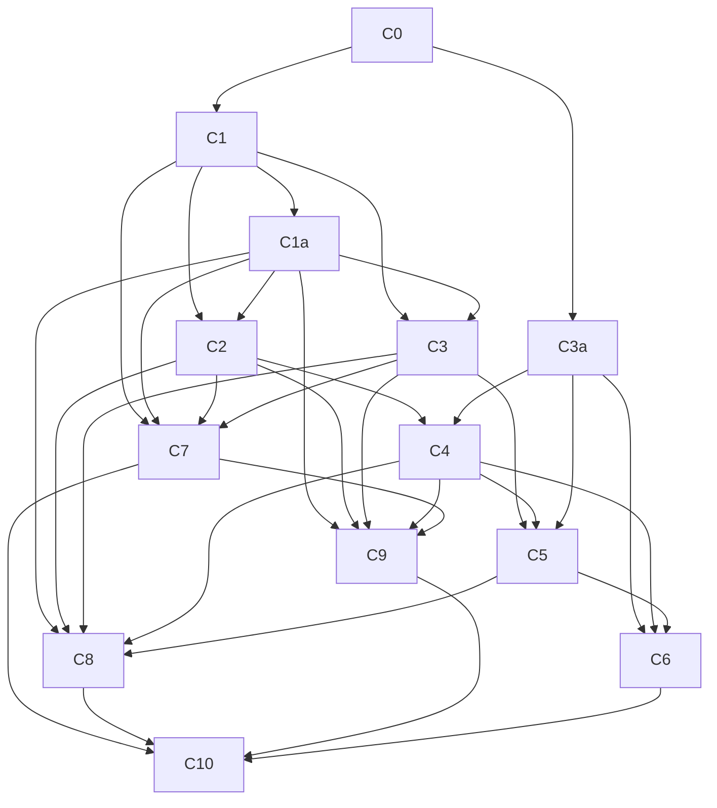

# Implementation Plan — Slack that Theo wants

> Durable planning artifact. This file records the source goal, assumptions, and a
> dependency-ordered set of implementation chunks. It is planning only — no app
> code is implemented here. Update `docs/progress.md` to track status; keep this
> file as the stable spec unless the goal itself changes.

## Source goal

The product goal is defined entirely by `README.md` (the only tracked project
file at the time this plan was written). Summary:

- An open-source Slack alternative inspired by Facebook Workplace, optimized for
  humans **and** agents.
- Core unit is a **post** (between a channel and a topic), with first-level
  comments and **unlimited nested replies**.
- **Old posts with new comments are bumped back to the top of the feed** —
  explicitly called out in `README.md` as *the most important feature*.
- Reply-to-specific-person inside comments without clogging the main post.
- Agents participate in the **same control plane** as humans (read context,
  infer priorities/status, post replies that bump posts) — not a bolted-on bot
  side channel.
- Code-block-friendly authoring/rendering (named Slack pain point).
- Strategic positioning: gradually replace Slack, not clone it outright. Theo
  has **not endorsed** the project (`README.md:3`); do not imply endorsement.

Authoritative line references: `README.md:7-14` (rationale/problems),
`README.md:17-22` (target shape), `README.md:24-26` (positioning).

## Assumptions and rationale

These are recorded because `README.md` is product rationale, not a detailed
spec. Each assumption is the minimal interpretation needed to make progress and
should be revisited when the team makes an explicit decision.

1. **Stack is undecided.** The repo is greenfield (only `README.md`, no
   `package.json`/lockfile/`tsconfig`/framework config). Chunk 0 must make the
   stack decision and establish conventions before any feature code. Stack
   selection is the first normal C0 task (not an external blocker); every later
   chunk waits on C0 completion. Rationale: without shared paths/test
   runner/formatter, every later chunk creates unreviewable churn.
2. **"Groups" ≈ shared workspaces/channels** where posts live
   (`README.md:26`: "you post what you want to do in a group"). Membership,
   permissions, and org hierarchy are **not specified** → modeled minimally. A
   baseline workspace/group membership model plus shared authorization
   middleware is introduced in **C1a** so every exposed endpoint enforces
   workspace/group isolation from the first endpoint; the full
   membership/invite/share lifecycle is deferred to C9.
3. **"Unlimited nesting"** means no *intentional product-level* depth limit.
   Implementation still needs safeguards for rendering, pagination, recursion,
   and abuse prevention. Storage strategy (adjacency list + materialized path
   or recursive CTE) is a Chunk 1 decision.
4. **Feed bumping is a data-layer invariant, not a UI sort.** `README.md:20`
   marks it as most important; implementing it only on the client is incorrect.
   Any new comment/reply/agent reply must atomically and monotonically update
   the parent post's `lastActivityAt` through a **single shared bump helper**
   owned by C1, so C2 and C3 never invent competing implementations.
5. **Agents use the same post/comment/reply primitives as humans.** A separate
   bot-message table would violate the same-control-plane goal and duplicate
   behavior. Actor identity must represent both humans and agents. The actor
   schema (human/agent discriminator + reference constraints) is owned by **C1**;
   C7 only adds agent credentials and control-plane access on top of the existing
   actor type.
6. **MVP boundary:** prioritize the Workplace-like post/comment/reply/feed model
   over broad Slack parity. DMs, calls/huddles, emoji reactions, file
   management, enterprise admin, search, notifications, and cross-company
   federation are **out of MVP scope** unless required by a later chunk.
7. **Slack cross-company shared-channel replacement** is strategically important
   (`README.md:7`) but underspecified → deferred roadmap, not MVP.
8. **Auth, notifications, search, moderation, agent protocol/identity/security
   boundary** are unspecified → introduced minimally and only when a chunk
   demands them (security baseline in C1a; real auth/workspace in C9; agent
   credentials in C7).
9. **Deletion is minimally specified.** MVP uses soft-delete (`deletedAt`) for
   posts and comments/replies; hard delete and moderation tooling are deferred.
   C1's data layer rejects inserts into a deleted post/comment subtree and
   returns tombstone placeholders with children preserved.
10. **User content is sanitized before any UI display.** A safe content
    renderer/sanitizer is established in **C3a** as a prerequisite for C4/C5; no
    UI chunk may render raw stored content. Syntax highlighting/copy affordances
    remain C6 polish on top of the C3a renderer.

## Non-goals (explicitly deferred)

- Full Slack feature parity (DMs, calls, reactions, files, enterprise admin).
- Cross-company federation / shared-channel interoperability.
- Notifications system beyond realtime feed updates.
- Search.
- Moderation tooling (hard delete, bulk moderation).
- Mobile-native clients (web-first MVP).

## Chunk overview

Chunks are dependency-ordered. Each is reviewable, verifiable, and committable
as a standalone unit. Chunk IDs are stable identifiers used in
`docs/progress.md`. Inserted chunks use a letter suffix (C1a, C3a) so existing
IDs are never renumbered.

| ID    | Chunk                                          | Depends on        |
| ----- | ---------------------------------------------- | ----------------- |
| C0    | Product/architecture baseline and scaffold     | —                 |
| C1    | Domain model and persistence migrations        | C0                |
| C1a   | Security baseline: principal, membership, authorization middleware | C1 |
| C2    | Post feed API                                  | C1, C1a           |
| C3    | Comment/reply API with unlimited nesting       | C1, C1a           |
| C3a   | Safe content rendering baseline                | C0                |
| C4    | Minimal human UI: feed and post creation       | C2, C3a           |
| C5    | Conversation UI: comments and nested replies   | C3, C4, C3a       |
| C6    | Code block / message authoring experience      | C3a, C4, C5       |
| C7    | Agent identity and API control plane           | C1, C1a, C2, C3   |
| C8    | Realtime / activity updates                    | C1a, C2, C3, C4, C5 (optionally C7) |
| C9    | Auth, workspace boundaries, collaboration base | C1a, C2, C3, C4, C7 |
| C10   | Hardening and review pass                      | all core flows    |

Dependency graph:

---

## C0 — Product/architecture baseline and scaffold

**Depends on:** none.
**Goal:** Establish the stack, project structure, and runnable dev/test scripts
so every later chunk has shared conventions. No product features.

### Checklist

- [ ] Decide and record the stack (language, framework, persistence, test runner, formatter/linter) in `README.md` or a new `docs/stack-decision.md`
- [ ] Create package/app manifest (e.g. `package.json`/`pyproject.toml`/`go.mod`) with dev/build/test/lint/typecheck scripts
- [ ] Create source tree skeleton (`src/` or framework equivalent) with a minimal health page or API route
- [ ] Add formatter and linter configuration
- [ ] Add test runner configuration and a single placeholder-free smoke test that runs
- [ ] Add `.gitignore` appropriate to the stack (build output, deps, env)
- [ ] Document the one-command dev and one-command test invocations

### Required verification

- A fresh checkout can install dependencies and run the smoke test with a single
  command.
- `dev` script starts the app and the health route responds.
- Every script declared in the package/app manifest (`dev`, `build`, `test`,
  `lint`, `typecheck`) runs to a clean exit on a fresh checkout. Do not declare
  scripts the chunk does not verify.
- No product feature behavior is asserted — this chunk is scaffold only.

### Parallel-safety / worktree notes

- **Must land first.** Every other chunk depends on paths, language, framework,
  and test runner conventions established here. Do not parallelize with C1+.
- Worktree: trivially safe since no other work exists yet.

---

## C1 — Domain model and persistence migrations

**Depends on:** C0.
**Goal:** Define durable entities and migrations for the post/comment/reply tree
with the feed-bump invariant enforced at the data layer. C1 is the **single
owner** of the actor schema (human/agent discriminator and reference
constraints) and the shared post-activity bump helper.

### Checklist

- [ ] Define entities: workspace/group, actor (human or agent), post, comment/reply tree node. C1 owns the actor schema including the human/agent discriminator and actor-polymorphism constraints; C7 only adds agent credentials/control-plane access on top
- [ ] Model comment/reply as a tree node with `parentId`, `rootPostId`, `authorActorId`, content, timestamps
- [ ] Add `lastActivityAt` on post; define it as the feed-ordering field
- [ ] Define and implement the shared post-activity bump helper (atomic `post.lastActivityAt` update on any new comment/reply) so C2 and C3 reuse one implementation and never invent competing bump logic
- [ ] Implement atomic update of `post.lastActivityAt` on any new comment/reply insertion via the shared bump helper (transaction/stored proc/trigger per stack)
- [ ] Add `deletedAt` nullable timestamp (soft-delete) on post and comment/reply tree nodes; hard delete is out of MVP scope
- [ ] Add migration(s) that create all tables with constraints (FK parent/child, actor polymorphism, workspace boundary, soft-delete column)
- [ ] Choose and implement unlimited-depth storage strategy (adjacency list + recursive query, or materialized path) — record the choice
- [ ] Add repository/schema tests proving: arbitrary-depth insertion, parent/child constraints, invalid parent rejection, `lastActivityAt` updates on every nested reply, soft-delete tombstone behavior, actor polymorphism (human and agent rows satisfy the actor reference)

### Required verification

- Migration applies cleanly on a fresh database and rolls back cleanly.
- Repository tests prove unlimited-depth reply storage and parent/child
  constraints.
- Test proves a nested reply at depth N updates the root post's
  `lastActivityAt` atomically via the shared bump helper.
- Test proves actor polymorphism (human and agent rows satisfy the actor
  reference).
- Test proves soft-deleted posts/comments are marked and retrievable as
  tombstones without hard-removing their children.

### Parallel-safety / worktree notes

- Backend/data-layer owned. Avoid UI work in the same files (generated types
  excepted if the stack uses them).
- C1 owns the actor schema and the shared bump helper contract. C2, C3, and C7
  must reuse these and must not re-define the actor type or bump logic.
- Coordinate with C2 and C3 on the shared bump helper interface so bump logic is
  not duplicated.

---

## C1a — Security baseline: principal, membership, authorization middleware

**Depends on:** C1.
**Goal:** Establish the security baseline — actor principal resolution,
workspace/group membership, shared authorization middleware, per-endpoint
read/write scope checks, and reusable scope/filter helper contracts — so every
later exposed API, realtime, and agent surface enforces workspace/group
isolation from the first endpoint it owns. Real sign-in and invite/share are
deferred to C9; this chunk ships a
stubbed principal resolver that C9 replaces.

### Checklist

- [ ] Implement actor principal resolution from requests (stubbed auth mapping a request to an actor + workspace/group; real sign-in deferred to C9)
- [ ] Implement baseline workspace/group membership model (enough to scope reads/writes; full membership lifecycle and invite/share deferred to C9)
- [ ] Implement shared authorization middleware with per-endpoint read/write scope checks for workspace/group, reused by all C2/C3/C7/C8 surfaces
- [ ] Provide reusable workspace/group scope and filtering helpers for later feed, event, agent, and status surfaces without exposing those surfaces in C1a
- [ ] Add direct middleware/helper tests proving cross-workspace/group reads and writes are rejected and scoped collection filters exclude unauthorized human and stubbed-agent principals

### Required verification

- Test proves a principal cannot read or write outside its workspace/group
  through the shared middleware.
- Direct helper tests prove workspace/group scope filters include authorized
  records and exclude unauthorized records for human and stubbed-agent
  principals, without depending on C2 feed APIs or C8 event streams.

### Parallel-safety / worktree notes

- **Must land before C2/C3 expose endpoints.** Backend-only; defines the
  middleware contract every later API/realtime/agent chunk consumes.
- C9 replaces the stubbed principal resolver with real sign-in and extends the
  membership model; the shared middleware and per-endpoint checks persist.

---

## C2 — Post feed API

**Depends on:** C1, C1a.
**Goal:** Endpoints/services to create posts and list them ordered by bumped
activity, within workspace/group boundaries enforced via the C1a authorization
middleware.

### Checklist

- [ ] Define service interface for post creation and feed listing
- [ ] Implement create-post endpoint (author, workspace/group, content, initial `lastActivityAt`)
- [ ] Implement list-feed endpoint ordered by `lastActivityAt` descending
- [ ] Implement read-post endpoint returning post + comment-tree metadata
- [ ] Enforce workspace/group boundary on every endpoint via the C1a authorization middleware (even before real sign-in)
- [ ] Enforce feed listing scope by applying the C1a workspace/group filter helper before ordering/pagination
- [ ] Add cursor-based pagination for the feed with a deterministic order: `lastActivityAt DESC, postId DESC` (or the stack's stable unique-key equivalent); the cursor encodes this composite order so equal timestamps never produce duplicate or skipped posts
- [ ] Add API tests: newest post ordering, old post bumps after C1-seeded comment activity (data-layer bump via the shared C1 bump helper), empty state, pagination cursor behavior including multiple posts sharing the same `lastActivityAt`, cross-workspace rejection, feed listings exclude posts outside the principal's workspace/group

### Required verification

- API test proves feed ordering follows `lastActivityAt`, not creation time.
- API test proves an old post moves to the top after C1-seeded comment activity
  bumps its `lastActivityAt` (the C1 bump invariant), without requiring the C3
  reply endpoint.
- API test proves pagination is stable when multiple posts share the same
  `lastActivityAt` (no duplicate or skipped posts across pages).
- API test proves cross-workspace reads/writes are rejected and feed listings
  exclude posts outside the principal's workspace/group.

### Parallel-safety / worktree notes

- Can run alongside C3 **only after** the shared post-activity bump helper
  contract (defined in C1) is agreed; C2's bump verification uses C1-seeded
  activity, not the C3 reply endpoint.
- Do not duplicate bump logic — reuse the C1 shared bump helper.

---

## C3 — Comment/reply API with unlimited nesting

**Depends on:** C1, C1a. Shares service contracts with C2.
**Goal:** Create first-level comments and replies to any comment, fetch
subtrees/threads, preserve reply-target context, and define deleted-parent
behavior.

### Checklist

- [ ] Define service interface for comment/reply creation and subtree fetch
- [ ] Implement create first-level comment on a post
- [ ] Implement create reply to any comment (arbitrary depth)
- [ ] Preserve `replyToActorId` / target context so users can reply to different people without clogging the main post
- [ ] Implement fetch-subtree and fetch-full-thread endpoints
- [ ] Ensure every reply triggers the shared C1 atomic `lastActivityAt` bump helper on the root post (no duplicate implementation)
- [ ] Define deleted-parent behavior: reject replies to a soft-deleted parent (cannot reply into a deleted subtree); fetching a subtree containing a deleted node returns a tombstone placeholder (redacted author/content) while preserving retrievable children
- [ ] Define stable sibling ordering for replies under the same parent (e.g., `createdAt ASC, nodeId ASC`)
- [ ] Enforce workspace/group boundary on every endpoint via the C1a authorization middleware
- [ ] Add API tests: arbitrary-depth insertion, invalid/missing parent rejection, deleted-parent behavior (reply rejected + tombstone with children preserved), sibling ordering, feed bump side effect on every nested reply

### Required verification

- API test proves replies at arbitrary depth insert and retrieve correctly.
- API test proves invalid parent id is rejected.
- API test proves every nested reply bumps the root post's `lastActivityAt` via
  the shared bump helper (endpoint-level).
- API test proves `replyToActorId` targeting is preserved and queryable.
- API test proves deleted-parent behavior: replies to a soft-deleted parent are
  rejected and subtrees return tombstones with children preserved.

### Parallel-safety / worktree notes

- Backend-only if service boundaries are clear.
- Coordinate with C2 on the shared C1 bump helper to avoid duplicated bump logic.
  If C2 and C3 run in parallel worktrees, agree on the shared bump helper
  interface before branching.

---

## C3a — Safe content rendering baseline

**Depends on:** C0.
**Goal:** Choose the rendering strategy and implement a safe content
renderer/sanitizer that every UI chunk (C4/C5) reuses, so no user content is
ever rendered raw. This is a prerequisite for all UI that displays post,
comment, or reply content.

### Checklist

- [ ] Choose and record rendering strategy (markdown library, rich-text, or custom)
- [ ] Implement safe HTML sanitization/escaping (no script execution) for post/comment/reply content
- [ ] Provide a reusable render function/component consumed by C4 and C5
- [ ] Add tests: injected `<script>`/unsafe HTML does not execute through the renderer; content is escaped/sanitized on every render path

### Required verification

- Test proves injected `<script>`/unsafe HTML does not execute through the
  renderer.
- Test proves the renderer is reusable and escapes/sanitizes content on every
  supported surface (post, comment, reply).

### Parallel-safety / worktree notes

- Can run alongside C1/C1a/C2/C3 after C0 lands; it is a pure rendering utility
  over content strings and does not require the API or persistence layers.
- UI integration lands in C4/C5, which must depend on this chunk and must never
  render raw stored content.

---

## C4 — Minimal human UI: feed and post creation

**Depends on:** C2, C3a.
**Goal:** Landing/feed view showing posts sorted by bumped activity, plus
create-post. All post content is rendered through the C3a safe renderer.

### Checklist

- [ ] Implement feed/landing view consuming the C2 list-feed endpoint
- [ ] Render post cards ordered by API response order (do not re-sort client-side)
- [ ] Render all post content through the C3a safe renderer/sanitizer (never render raw stored content)
- [ ] Implement create-post form calling the C2 create endpoint
- [ ] Add loading, error, and empty states
- [ ] Add component or E2E test proving creating a post appears in the feed
- [ ] Add test proving feed ordering follows the API order
- [ ] Add test proving unsafe HTML/script in post content is escaped/sanitized on the feed and post-creation surfaces (via the C3a renderer)

### Required verification

- E2E or component test proves a newly created post appears at the top of the
  feed.
- Test proves the UI does not override API ordering.
- Test proves unsafe HTML/script in post content is escaped/sanitized on the
  feed and post-creation surfaces (via the C3a renderer).

### Parallel-safety / worktree notes

- Can proceed in parallel with C3 after C2 response shapes and the C3a renderer
  are agreed.
- Do **not** implement comment composition here (that is C5).

---

## C5 — Conversation UI: first-level comments and nested replies

**Depends on:** C3, C4, C3a.
**Goal:** Post detail view with inline comments, nested reply composer,
indentation/collapse for deep trees, visible reply-target context. All
comment/reply content is rendered through the C3a safe renderer.

### Checklist

- [ ] Implement post detail view consuming C2 read-post and C3 subtree endpoints
- [ ] Render first-level comments inline under the post
- [ ] Implement nested reply composer on each comment/reply
- [ ] Implement indentation and collapse strategy for deep trees (with rendering safeguard for very deep nesting)
- [ ] Show reply-target context (who is being replied to) without clogging the main post
- [ ] Render all comment/reply content through the C3a safe renderer/sanitizer (never render raw stored content)
- [ ] Add E2E test proving replying to different comments renders in the correct location
- [ ] Add E2E test proving a reply on an old post bumps it to the top of the feed (end-to-end bump behavior)
- [ ] Add test proving unsafe HTML/script in comment/reply content is escaped/sanitized on every nested reply surface (via the C3a renderer)

### Required verification

- E2E test proves a reply renders at the correct nested location.
- E2E test proves the parent post bumps to the top of the feed after a reply
  (the headline product behavior from `README.md:20`).
- Test proves unsafe HTML/script in comment/reply content is escaped/sanitized
  on every nested reply surface (via the C3a renderer).

### Parallel-safety / worktree notes

- UI-focused; depends on stable C3 comment API contracts and the C3a renderer.
- Can be split into rendering-only and composer-mutation sub-tasks across
  worktrees if the C3 contract is frozen.

---

## C6 — Code block / message authoring experience

**Depends on:** C3a, C4, C5.
**Goal:** Fenced code block rendering, syntax highlighting, and copy affordances
built on top of the C3a safe renderer. Sanitization and the base rendering
strategy are owned by C3a; this chunk adds code-block polish.

### Checklist

- [ ] Implement fenced code block rendering with syntax highlighting and copy affordance (on top of the C3a renderer)
- [ ] Ensure code formatting is preserved inside nested replies
- [ ] Add optional preview mode if desired
- [ ] Add tests: code fences render as code, code formatting preserved in nested replies, code-block content is still sanitized (defense-in-depth via C3a)

### Required verification

- Test proves fenced code blocks render as code blocks with highlighting.
- Test proves code formatting survives nested reply rendering.
- Primary unsafe-HTML/sanitization verification is owned by C3a; C6 verifies
  code-block content does not bypass the C3a sanitizer.

### Parallel-safety / worktree notes

- Independent of agent work (C7). Touches rendering/editor components only.
- Safe to run in a separate worktree from C7/C8.

---

## C7 — Agent identity and API control plane

**Depends on:** C1, C1a, C2, C3.
**Goal:** Agents participate in the same post/comment/reply tree as humans,
using stable read/write APIs and scoped credentials with a defined lifecycle and
write-safety contract. The actor schema itself is owned by C1; C7 adds agent
credentials and control-plane access on top of the existing human/agent actor
type.

### Checklist

- [ ] Use the existing C1 human/agent actor type for agent identity (no separate bot-message table); add only agent-specific profile/metadata fields. The actor schema itself is owned by C1 and must not be re-defined here
- [ ] Implement scoped API tokens or service credentials for agents, stored hashed (never plaintext), with one-time secret display at issuance
- [ ] Implement credential rotation and revocation
- [ ] Add audit logging for agent write actions (create post/comment/reply)
- [ ] Add rate limits/quotas for agent API calls
- [ ] Require idempotency keys for agent create-post/comment/reply calls to prevent duplicate replies and extra bumps on retry/replay
- [ ] Expose endpoints for agents to create posts/comments/replies using the same C2/C3 services, routed through the C1a authorization middleware
- [ ] Expose machine-readable feed polling or event subscription endpoint with least-privilege/redaction for agent callers
- [ ] Define and expose a machine-readable priority/status metadata contract (per-post `lastActivityAt`, reply count, active/unresolved status, actor type) ordered by activity, so agents can infer priorities without scraping UI text
- [ ] Redact/least-privilege scope feed, event, and status metadata APIs for agent callers (no cross-workspace leakage)
- [ ] Add API tests proving an agent can join a post/comment tree and its replies bump posts identically to human replies; credential lifecycle (hashed storage, one-time issuance, rotation, revocation); audit logging for create post/comment/reply; rate-limit/quota enforcement; idempotency (no duplicate reply/bump on replay); metadata redaction; related migration apply/rollback for any C7 persistent security structures

### Required verification

- API test proves an agent actor can create a reply and the post bumps exactly
  as a human reply does.
- API test proves agent credentials are scoped (cannot act outside its
  workspace/group).
- API test proves an agent can retrieve the machine-readable priority/status
  metadata and infer ordering/activity without scraping UI text.
- API test proves credentials are stored hashed and the secret is shown only
  once at issuance.
- API test proves credential rotation issues a new one-time secret, rejects the
  old secret, and retains only hashed credential material.
- API test proves revoked credentials are rejected.
- API test proves audit records are emitted for each agent create-post,
  create-comment, and create-reply action.
- API test proves rate-limit/quota enforcement rejects excess agent writes and
  does not create duplicate writes or extra bumps when limits are exceeded.
- API test proves a replayed agent write with the same idempotency key does not
  create a duplicate reply or extra bump.
- Migration verification proves any C7 persistent security structures
  (credentials, audit logs, idempotency keys, rate-limit/quota state, or related
  tables) apply cleanly and roll back cleanly.
- API test proves agent feed/event/status metadata is redacted to
  least-privilege (no cross-workspace leakage).

### Parallel-safety / worktree notes

- Can run alongside UI polish (C4/C5/C6) once the C1 actor schema and C1a
  middleware are stable.
- Coordinate only on how agent badges/identity appear in the UI (deferred to
  C5/C10).

---

## C8 — Realtime / activity updates

**Depends on:** C1a, C2, C3, C4, C5 (optionally C7).
**Goal:** Feeds and post details update live when posts/comments/agent replies
arrive, preserving bumped ordering without full manual refresh. Events are
actor-agnostic and emitted from the shared post/comment/reply services, so
future C7 agent endpoints dispatch through the same event path without a hard
C7 dependency.

### Checklist

- [ ] Choose and record transport (websocket, SSE, or polling) — implemented as SSE (`GET /events`); pending orchestrator verification before marking complete
- [ ] Emit actor-agnostic events from the shared post/comment/reply services on post creation, comment/reply creation, and agent replies (so C7 agent endpoints dispatch through the same event path; C7 remains optional) — implemented via `ActivityEventHub` and service-level publishers; pending orchestrator verification
- [ ] Define a versioned event contract: versioned event names/payloads, producer and consumer dispatch responsibilities (feed vs post-detail handlers), authorization/filtering rules per workspace/group, unknown-event behavior, and compatibility/rollback expectations — documented in `docs/stack-decision.md`; pending orchestrator verification
- [ ] Filter realtime events by workspace/group membership via the C1a authorization middleware (no cross-workspace leakage) — `/events` resolves C1a principals and the hub scopes delivery by workspace; pending orchestrator verification
- [ ] Implement live feed reordering so bumped posts move to the top without refresh — feed handler fetches `/feed/fragments/posts/:postId` and prepends/replaces cards; pending orchestrator verification
- [ ] Implement live post-detail update for new comments/replies — detail handler fetches `/feed/:postId/fragments/conversation` for matching roots; pending orchestrator verification
- [ ] Add integration/E2E tests proving a background comment on an old post moves it to the top without manual refresh; each emitted event type reaches the intended feed and post-detail handlers; events do not leak across workspace/group boundaries — targeted tests added; pending orchestrator verification

### Required verification

- E2E/integration test proves a background reply on an old post moves it to the
  top of the feed without a manual refresh.
- Integration test proves each emitted event type reaches the intended feed and
  post-detail handlers.
- Integration test proves realtime events do not leak across workspace/group
  boundaries.

### Parallel-safety / worktree notes

- Cross-cutting; land after core APIs/UI to avoid churn.
- Touches both backend event emission and frontend subscription — coordinate
  the versioned event contract before branching worktrees.
- Because events are actor-agnostic, agent-reply live updates work
  automatically once C7 lands; no hard C7 dependency is required.

---

## C9 — Auth, workspace boundaries, collaboration base

**Depends on:** C1a, C2, C3, C4, C7.
**Goal:** Real sign-in, full workspace/group membership and invite/share model,
and replacing the C1a stubbed principal resolver with authenticated principals —
built on the C1a security baseline and shared authorization middleware.

### Checklist

- [ ] Implement real sign-in, replacing the C1a stubbed principal resolution with authenticated principals
- [ ] Extend the C1a baseline membership model with the full membership lifecycle and invite/share model
- [ ] Implement channel/group-level feed boundaries
- [ ] Implement invite/share model
- [ ] Replace the C1a stubbed auth in the shared authorization middleware with sign-in-backed principals; retain per-endpoint read/write scope checks across all C2/C3 endpoints
- [ ] Ensure agent credentials inherit correct workspace/group scope
- [ ] Add migrations/constraints/backfills for auth, membership, invite/share, and agent-credential-scoping tables; preserve earlier workspace/group/post/comment data
- [ ] Verify migrations apply on a fresh database, migrate from the pre-C9 state, and roll back cleanly; seed any default membership required to keep existing data accessible
- [ ] Add tests proving users cannot read/write outside their workspace/group
- [ ] Add tests proving agent credentials inherit correct scope
- [ ] Add tests proving C9 migrations apply cleanly, migrate from pre-C9 state without data loss, and roll back cleanly; seeded/default membership preserves access to pre-C9 data

### Required verification

- Test proves a user cannot read or write posts/comments outside their
  workspace/group.
- Test proves agent credentials are scoped to their workspace/group.
- Test proves C9 migrations apply cleanly on a fresh database, migrate from the
  pre-C9 state without data loss, and roll back cleanly.
- Test proves seeded/default membership preserves access to pre-C9
  workspace/group/post/comment data.

### Parallel-safety / worktree notes

- Security-sensitive and cross-cutting. Avoid parallel edits to API handlers
  without a shared middleware contract (owned by C1a).
- Best sequenced after C2/C3/C7 handler signatures are stable.

---

## C10 — Hardening and review pass

**Depends on:** all user-visible core flows (C1–C9).
**Goal:** Accessibility, error-state completeness, performance checks, indexes,
and developer/agent documentation.

### Checklist

- [ ] Accessibility pass on feed and post-detail views
- [ ] Error-state completeness (network failures, permission denied, not found)
- [ ] Database indexes for feed query and comment-tree query
- [ ] Performance check/benchmark for deep nesting and feed pagination
- [ ] Local-dev documentation (install, run, test)
- [ ] API usage documentation for human and agent consumers
- [ ] Targeted tests for deep-nesting rendering and feed pagination performance

### Required verification

- Benchmark demonstrates acceptable feed pagination and deep-thread rendering
  performance at agreed thresholds.
- Docs allow a new developer or agent to run the app locally and call the API.

### Parallel-safety / worktree notes

- Can split by concern (a11y, perf, docs) across worktrees after implementation
  stabilizes.
- Do **not** start before smoke tests confirm the end-to-end product flow works.

---

## Known blockers / deferred items

- **Stack decision (C0):** Resolved — see `docs/stack-decision.md`. C0 is done;
  downstream chunks proceed per their dependency ordering.
- **Slack cross-company federation:** Strategically important per
  `README.md:7` but unspecified. Deferred to post-MVP roadmap.
- **Notifications, search, moderation (including hard delete):** Unspecified in
  `README.md`; deferred. MVP uses soft-delete only.
- **Full agent protocol/identity/security boundary:** Minimally specified. C7
  covers the minimum (credentials, control plane, write-safety); a fuller agent
  protocol is deferred.
- **Theo endorsement:** `README.md:3` states no endorsement. Naming/marketing
  must not imply endorsement. Not a code blocker.

## Tracker convention

Status of every checklist item is tracked in `docs/progress.md` using these
markers:

| Marker       | Meaning                                                        |
| ------------ | -------------------------------------------------------------- |
| `[ ]`        | Not started                                                    |
| `[~]`        | In progress (add `— <note>` with worktree/owner if useful)     |
| `[x]`        | Done and verified per the chunk's "Required verification"      |
| `[!]`        | Blocked (add `— <note>` describing the blocker and owner)      |

Rules:

- An item is `[x]` **only** after its chunk's required verification has passed.
  Implementation alone is not sufficient.
- Never mark an item done in this file; this file is the stable spec. Update
  `docs/progress.md` only.
- Chunk status is the aggregate of its checklist items:
  - `not started` — all `[ ]`
  - `in progress` — any `[~]` or mixed
  - `blocked` — any `[!]` blocking further progress
  - `done` — all `[x]`
- When marking blocked, record the blocker and which chunk/owner must resolve
  it.

## Plan review resolutions

Recorded 2026-06-27 after a multi-pass plan review. All findings were
actionable; none were discarded. Resolutions:

1. **Single ownership for agent actor schema (blocking).** C1 is now the single
   owner of the actor schema (human/agent discriminator, reference constraints,
   actor-polymorphism tests). C7 only adds agent credentials/control-plane
   access on top of the existing C1 actor type.
2. **Deleted-parent behavior (blocking).** Defined minimal soft-delete
   (`deletedAt`) in C1 and explicit deleted-parent behavior in C3: replies into
   a deleted subtree are rejected; subtrees return tombstone placeholders with
   children preserved. Hard delete/moderation remain deferred.
3. **Agent priority/status metadata verification (blocking).** C7 now defines a
   machine-readable priority/status metadata contract and adds required
   verification that an agent can retrieve it without scraping UI text.
4. **C9 migration/rollback accounting (nonblocking).** C9 now has checklist and
   verification items for auth/membership/invite/credential migrations,
   fresh apply, migration from pre-C9 state, rollback, and seeded/default
   membership preserving earlier data.
5. **C0 stack status clarity (nonblocking).** Stack selection is reframed as
   the first normal C0 task, not an external blocker with an unassigned owner;
   downstream chunks wait on C0 completion.
6. **C8 agent-reply realtime contract (nonblocking).** C8 now emits
   actor-agnostic events from the shared services so C7 agent endpoints
   dispatch through the same path; C7 remains optional.
7. **Stable feed cursor ordering (nonblocking).** C2 now defines the
   deterministic order `lastActivityAt DESC, postId DESC` and a pagination test
   for equal-`lastActivityAt` posts.
8. **Sanitization before UI rendering (blocking).** New chunk C3a owns the safe
   content renderer/sanitizer as a prerequisite for C4/C5; C4/C5 must render
   through it and verify unsafe HTML is escaped on every surface. C6 keeps
   code-block polish only.
9. **Authorization before exposed APIs/realtime/agents (blocking).** New chunk
   C1a owns the security baseline (principal, membership, authorization
   middleware, and reusable scope/filter helpers) and must land before C2/C3
   expose endpoints; actual feed and event surface verification is owned by C2
   and C8; C7/C8 depend on C1a; C9 replaces the stub with real sign-in.
10. **C2 independently verifiable (blocking).** C2's bump verification now uses
    C1-seeded comment activity (data-layer bump) instead of the C3 reply
    endpoint; endpoint-level nested-reply bump verification stays in C3. The
    shared bump helper contract is defined in C1.
11. **Agent credential lifecycle/write-safety (blocking).** C7 now requires
    hashed credential storage, one-time issuance, rotation/revocation, audit
    logging, rate limits/quotas, idempotency keys for agent writes, and
    least-privilege/redaction of feed/event/status metadata, with matching
    verification for rotation, audit logging, rate-limit/quota enforcement, and
    related migration apply/rollback when C7 introduces persistent security
    structures.
12. **Realtime event contract and rollback plan (nonblocking).** C8 now
    requires a versioned event contract (names/payloads, producer/consumer
    dispatch, auth/filtering, unknown-event behavior, compatibility/rollback)
    and tests that each event reaches the intended handlers without
    cross-workspace leakage.
13. **Verify every C0 scaffold script (nonblocking).** C0 verification now
    requires every declared script (`dev`, `build`, `test`, `lint`, `typecheck`)
    to run to a clean exit on a fresh checkout.

Discarded findings: none.
