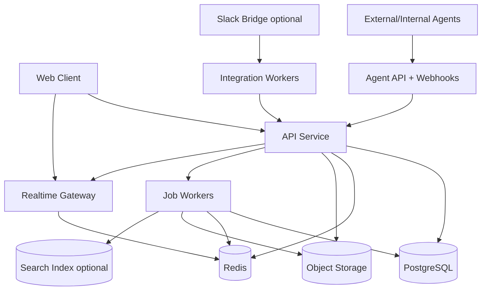
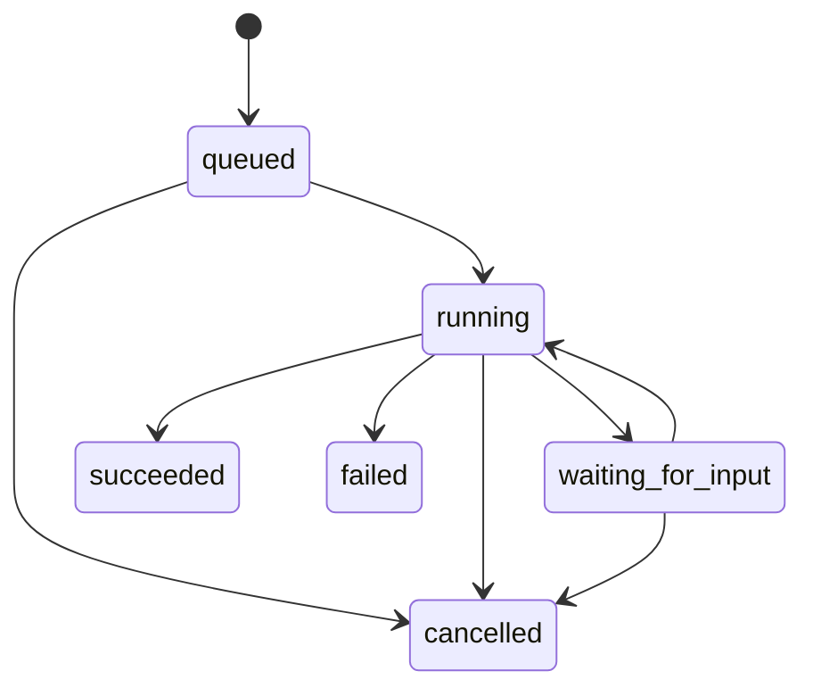

# Design: Slack That Theo Wants

## 0. Document status

**Purpose:** Provide an implementation-ready design for an open-source collaboration product that replaces Slack's message/thread mental model with a Facebook Workplace-like post/comment/reply model and treats agents as first-class participants.

**Important attribution:** The product direction is inspired by Theo's public comments. Theo has not endorsed this project.

**Reference implementation assumption:** This design assumes a TypeScript-first monorepo using React/Next.js for the web client, a Node.js API service, PostgreSQL as the source of truth, Redis for jobs/pub-sub, object storage for files, and WebSockets/SSE for realtime updates. The design is intentionally modular enough to port to other stacks.

---

## 1. Product thesis

Slack is optimized around ephemeral messages in channels. Threads exist, but they are second-class: replies disappear into a side panel/history, nested reply structure is shallow, and active context can become hard to rediscover. This project uses **posts** as the primary unit of collaboration. A post is a durable work topic that lives in a group feed. Comments and nested replies happen under the post. When anyone adds meaningful activity under a post, the post returns to the top of the relevant feed.

The result should feel closer to Workplace/Facebook groups than chat:

- A feed of active work topics, not a firehose of messages.
- Discussion trees under each topic, not hidden thread drawers.
- Reply-to-person context without flooding the main feed.
- Old topics reactivated by new useful comments.
- Agents that can read, comment, update status, and be assigned work in the same control plane as humans.

---

## 2. Goals and non-goals

### 2.1 Goals

1. **Post-first collaboration**
   - The main surface is a group feed of posts.
   - Posts can represent decisions, asks, incidents, proposals, announcements, customer threads, design discussions, or agent tasks.

2. **Tree-structured discussion**
   - Posts support first-level comments and nested replies.
   - Users can reply to any comment, not only to the root post.
   - The UI supports deep nesting without becoming unreadable.

3. **Activity-bumped feeds**
   - New meaningful comments bump the parent post to the top of the feed.
   - Bump metadata is explicit and deterministic.
   - Users can filter by active, new, unread, mentioned, assigned, saved, stale, or resolved.

4. **Excellent code and technical writing experience**
   - Markdown/rich-text hybrid editor.
   - Reliable fenced code blocks, syntax highlighting, copy buttons, line numbers, collapsible blocks, diff blocks, and paste preservation.

5. **Agent-native control plane**
   - Agents are first-class actors with identity, permissions, subscriptions, comments, assignments, and status.
   - Agents can subscribe to post/comment events and write back into the same nested context.
   - Agent work is visible as comments, run cards, status changes, and artifacts.

6. **Cross-company collaboration**
   - Groups can include members from multiple organizations.
   - Shared groups must have explicit ownership, membership, auditability, and data-boundary controls.

7. **Open-source standard potential**
   - Data model and APIs should be stable, documented, exportable, and self-hostable.
   - The system should support integrations and migration paths rather than requiring a big-bang replacement of Slack.

### 2.2 Non-goals for the first implementation

1. **Full Slack clone parity**
   - Do not replicate every Slack feature. Direct messages, huddles, canvases, workflow builder, enterprise eDiscovery, and complex admin policy features can follow later.

2. **Perfect Slack realtime mirroring**
   - Slack import/bridge is useful, but Slack API limits and permissions make full bidirectional mirroring a risky core dependency.

3. **Unlimited UI indentation forever**
   - The domain model should allow arbitrary reply depth, but the UI should use progressive disclosure after a practical nesting threshold.

4. **Agent autonomy without explicit authorization**
   - Agents must operate with clear scopes, visible identity, auditable actions, and revocable installation.

---

## 3. Product concepts

### 3.1 Tenant

A tenant is the deployment/customer boundary. In self-hosted mode, one deployment may serve one tenant. In hosted SaaS mode, a tenant is the billing and data-isolation boundary.

### 3.2 Organization

An organization is a legal/company entity inside a tenant. Cross-company groups contain members from multiple organizations. A tenant may contain one primary organization plus external partner organizations.

### 3.3 Actor

An actor is any identity that can create content or perform actions.

Actor types:

- `user`: human account.
- `agent`: bot/AI/service worker with permissions and a manifest.
- `system`: internal automation used for audit-visible system events.

Posts, comments, reactions, assignments, and audit events should reference `actor_id`, not only `user_id`, so agents can participate without special casing every feature.

### 3.4 Group

A group is a feed container. It is the closest analogue to a Workplace group or a Slack channel, but the primary object inside it is a post rather than a message.

Group types:

- `public`: discoverable and joinable inside the organization.
- `private`: invite-only inside the organization.
- `shared`: cross-organization group with explicit external membership.
- `system`: generated group, such as agent run logs or integration imports.

### 3.5 Post

A post is a durable topic. It has a title, body, author actor, group, lifecycle status, activity timestamp, and a tree of comments.

Post examples:

- “Decision: use Postgres ltree for comment trees”
- “Customer ACME: onboarding blocker”
- “Incident: API latency spike”
- “Agent task: migrate Slack exports into posts”
- “Weekly project status”

### 3.6 Comment

A comment is a reply under a post. Comments can be root-level comments or nested replies to another comment. A comment belongs to exactly one post.

### 3.7 Activity

Activity is an event that may update feed ordering, unread state, notifications, or search index materialization.

Examples:

- post created
- comment created
- agent run status changed
- assignment created/completed
- post reopened/resolved
- mention created

Not every event should bump a post. See Section 6.

### 3.8 Assignment

An assignment connects a post or comment to an actor. Assignments make the app useful for agents because they create explicit work items and status transitions.

Assignment status:

- `open`
- `accepted`
- `in_progress`
- `blocked`
- `done`
- `cancelled`

### 3.9 Agent installation

An agent installation grants an agent a scope-limited presence in an organization, group, or post. It defines what the agent can read, write, subscribe to, and mutate.

---

## 4. User experience design

## 4.1 Main navigation

Primary surfaces:

1. **Home / Active Feed**
   - Cross-group feed ordered by `activity_at`.
   - Shows posts from groups the viewer can access.
   - Default view for day-to-day work.

2. **Groups**
   - Group-specific active feed.
   - Group members, pinned posts, saved views, and group settings.

3. **Mentions**
   - Comments/posts where the viewer was mentioned.

4. **Assigned**
   - Posts/comments/tasks assigned to the viewer or their agents.

5. **Agents**
   - Installed agents, agent runs, subscriptions, scopes, and failures.

6. **Search**
   - Full-text search across accessible posts/comments/files.

7. **Admin**
   - Organization, users, groups, external sharing, integrations, audit logs, retention.

## 4.2 Feed item card

Each post card in a feed should show:

- Group name.
- Author actor and organization.
- Title.
- Body preview.
- Status badge: open, resolved, archived, pinned, agent-running, blocked.
- Last activity line: actor, action, relative time.
- Comment count and unread count.
- Participant avatars, including agents.
- Assignment indicators.
- Primary action buttons: comment, follow/unfollow, save, assign, resolve.

Ordering:

1. Pinned posts, if scoped to the current feed and within pin window.
2. Posts with unread mentions, optionally boosted inside “For You”.
3. Remaining posts by `activity_at DESC`.
4. Tie-break by `created_at DESC`, then `id DESC`.

## 4.3 Post detail view

The post detail view contains:

1. Post header
   - Title, author, created time, group, organization visibility, status, actions.

2. Post body
   - Rich text/Markdown rendering.
   - Code blocks with syntax highlighting, copy button, wrapping toggle, and line numbers.

3. Activity summary
   - Last bump reason.
   - Participants.
   - Open assignments.
   - Agent run cards.

4. Comment tree
   - Root comments ordered by `created_at ASC` by default.
   - Nested replies under their parent.
   - Per-comment reply buttons.
   - Collapse/expand branches.
   - “Show N hidden replies” progressive disclosure.
   - Jump to unread.

5. Composer
   - Root comment composer at bottom.
   - Inline reply composers under any comment.

## 4.4 Deep nesting UI

The data model supports arbitrary depth. The UI should keep deep threads readable:

- Indent comments up to `MAX_VISIBLE_INDENT = 6` levels.
- After that, render replies in a “focused branch” view with breadcrumb context.
- Allow “Open branch” on any comment.
- Preserve parent context at the top of a focused branch.
- Add “replying to [actor]” label for direct reply clarity.

## 4.5 Composer and editor

MVP editor requirements:

- Markdown shortcuts.
- Fenced code blocks with language selection.
- Inline code.
- Block quotes.
- Bulleted/numbered/check lists.
- Mentions for users, agents, groups, and posts.
- File upload/paste.
- Link previews after send.
- Draft preservation per post/comment target.

Recommended editor architecture:

- Use a structured editor such as TipTap/ProseMirror or Lexical.
- Store canonical `content_json`.
- Store generated `content_markdown` for API/export/search.
- Render on server or trusted renderer; sanitize output.
- Do not store arbitrary HTML as canonical content.

## 4.6 Code block UX

Code block requirements:

- Preserve whitespace exactly on paste.
- Auto-detect language, allow manual override.
- Syntax highlight via a deterministic highlighter such as Shiki.
- Copy button.
- Optional line numbers.
- Optional line wrapping.
- Collapsible long blocks.
- Diff block rendering for `diff`, `patch`, and unified diff snippets.
- Download snippet action for large blocks.
- No lossy smart quote conversion inside code.

## 4.7 Notifications UX

Notification categories:

- Direct mention.
- Reply to your post/comment.
- Assignment to you or your agent.
- Agent needs input.
- Group default subscription event.
- Shared group invitation or membership change.

Notification controls:

- Follow/unfollow post.
- Mute post.
- Group-level default: all posts, mentions only, muted.
- Agent-specific notifications: run failed, waiting for input, completed.

## 4.8 Agent UX

Agents should appear as normal participants with additional affordances:

- Agent avatar and badge.
- “Installed in this group” indicator.
- “Ask agent” action on posts/comments.
- Agent run card showing status, started by, current phase, outputs, and errors.
- Agent comments that can be nested under the relevant context.
- Agent assignments visible in the Assigned surface.
- Human feedback controls: approve, reject, request changes, cancel run.

Agent comments should not expose private chain-of-thought. Store and show concise progress summaries, final outputs, citations/artifacts, tool events, and errors.

---

## 5. System architecture

## 5.1 Recommended stack

### Frontend

- `apps/web`: Next.js or Vite React app with TypeScript.
- UI primitives: Radix UI or equivalent accessible components.
- Styling: Tailwind CSS or CSS modules.
- Data fetching: TanStack Query or framework-native fetch cache.
- Virtualization: TanStack Virtual for large feeds/comment trees.
- Editor: TipTap/ProseMirror or Lexical.
- Realtime client: WebSocket preferred; SSE acceptable for MVP.

### Backend

- `apps/api`: Node.js TypeScript service using Fastify, NestJS, Hono, or equivalent.
- API style: REST with OpenAPI first. Use Zod/Valibot schemas for validation.
- Auth: server-managed sessions for MVP; add OIDC/SAML later.
- Jobs: BullMQ or equivalent on Redis.
- Realtime: WebSocket server with Redis pub/sub for horizontal scaling.
- Search indexing: PostgreSQL full-text search for MVP; optional OpenSearch/Meilisearch later.

### Data

- PostgreSQL 16+ as source of truth.
- Required extensions: `pgcrypto`, `ltree`, `pg_trgm`, optionally `unaccent`.
- Redis for rate limits, jobs, pub/sub, and ephemeral presence.
- S3-compatible object storage for attachments.

### DevOps

- Docker Compose for local development.
- Migrations via Drizzle, Prisma Migrate, node-pg-migrate, or Flyway.
- CI: lint, typecheck, unit tests, integration tests, Playwright smoke tests.
- Observability: OpenTelemetry, structured logs, metrics, error tracking.

## 5.2 Monorepo layout

```text
repo/
  apps/
    web/
      src/
        app/ or routes/
        components/
        features/
        hooks/
        lib/
    api/
      src/
        modules/
          auth/
          actors/
          orgs/
          groups/
          posts/
          comments/
          notifications/
          agents/
          integrations/
          search/
          realtime/
        server.ts
  packages/
    db/
      migrations/
      schema/
      client.ts
    shared/
      src/
        ids.ts
        permissions.ts
        events.ts
        api-types.ts
    ui/
    config/
    test-utils/
  infra/
    docker-compose.yml
    postgres/
    redis/
  docs/
    api.md
    agent-api.md
    deployment.md
```

## 5.3 High-level architecture diagram



---

## 6. Feed and bump semantics

## 6.1 Core rule

A post's group feed position is primarily determined by `posts.activity_at`. Meaningful new work under a post updates `activity_at`, causing the post to move back to the top of feeds where it is visible.

## 6.2 Events that bump a post by default

- Post creation.
- New comment or nested reply.
- Agent run comment/output posted to the post.
- Assignment created or status changed to `blocked`, `done`, or `needs_input`.
- Post reopened.
- Moderator/manual bump.

## 6.3 Events that do not bump by default

- Reaction added/removed.
- Comment edit.
- Typing/presence updates.
- Read receipts.
- Follow/unfollow.
- Silent metadata changes.
- Agent internal run-step logs that do not produce a visible comment/status.

## 6.4 Optional bump controls

Each write endpoint that can create activity should support a server-side `bump_policy` resolved from permissions and defaults:

```ts
type BumpPolicy =
  | 'default'      // server chooses based on event type
  | 'force_bump'   // moderator/agent/system only
  | 'silent'       // allowed for imports, edits, migrations, bot housekeeping
```

Rules:

- Normal user-created comments always bump unless the post is archived/locked.
- Slack imports should be `silent` during historical backfill.
- Realtime bridge messages should use `default` only after cutover or explicit bridge enablement.
- Agents may use `silent` for internal progress but should use `default` for meaningful user-visible outputs.

## 6.5 Feed query shape

```sql
SELECT p.*
FROM posts p
JOIN group_memberships gm
  ON gm.group_id = p.group_id
 AND gm.actor_id = :viewer_actor_id
WHERE p.deleted_at IS NULL
  AND p.archived_at IS NULL
  AND gm.can_read = true
ORDER BY
  CASE WHEN p.pinned_until IS NOT NULL AND p.pinned_until > now() THEN 0 ELSE 1 END ASC,
  p.activity_at DESC,
  p.created_at DESC,
  p.id DESC
LIMIT :limit;
```

For cross-group home feed, join all readable groups. Add cursor pagination using `(pinned_rank, activity_at, created_at, id)`.

## 6.6 Transactional bump algorithm

On comment creation:

```sql
BEGIN;

INSERT INTO comments (...)
VALUES (...)
RETURNING id, created_at;

UPDATE posts
SET
  comment_count = comment_count + 1,
  activity_at = CASE
    WHEN :should_bump THEN GREATEST(activity_at, :comment_created_at)
    ELSE activity_at
  END,
  last_activity_at = CASE
    WHEN :should_bump THEN :comment_created_at
    ELSE last_activity_at
  END,
  last_activity_actor_id = CASE
    WHEN :should_bump THEN :actor_id
    ELSE last_activity_actor_id
  END,
  last_comment_id = :comment_id,
  updated_at = now()
WHERE id = :post_id;

INSERT INTO activity_events (...);

COMMIT;
```

After commit:

- Publish realtime event.
- Enqueue notification job.
- Enqueue search-index job.
- Enqueue agent subscription delivery job.

## 6.7 Unread handling

Unread state should not be inferred only from timestamps. Use per-user/post read state:

```text
post_read_states
  actor_id
  post_id
  last_read_activity_at
  last_read_comment_count
  last_read_comment_id
  updated_at
```

A post is unread if:

- `posts.activity_at > post_read_states.last_read_activity_at`, or
- no read state exists and the post was created before/after relevant user join policy.

Mention notifications remain unread until explicitly dismissed or the target content is viewed.

---

## 7. Data model

## 7.1 ID strategy

Use opaque, sortable IDs at the application layer. Recommended:

- UUIDv7 if available in the chosen runtime/database.
- ULID if UUIDv7 support is not mature.
- Avoid exposing sequential integer IDs.

All tables should have:

- `id`
- `created_at`
- `updated_at`
- `deleted_at` for soft deletion where user-facing content needs audit/recovery.

## 7.2 Core tables

### tenants

```sql
CREATE TABLE tenants (
  id uuid PRIMARY KEY DEFAULT gen_random_uuid(),
  name text NOT NULL,
  slug text NOT NULL UNIQUE,
  plan text NOT NULL DEFAULT 'self_hosted',
  created_at timestamptz NOT NULL DEFAULT now(),
  updated_at timestamptz NOT NULL DEFAULT now(),
  deleted_at timestamptz
);
```

### organizations

```sql
CREATE TABLE organizations (
  id uuid PRIMARY KEY DEFAULT gen_random_uuid(),
  tenant_id uuid NOT NULL REFERENCES tenants(id),
  name text NOT NULL,
  slug text NOT NULL,
  verified_domain text,
  created_at timestamptz NOT NULL DEFAULT now(),
  updated_at timestamptz NOT NULL DEFAULT now(),
  deleted_at timestamptz,
  UNIQUE (tenant_id, slug)
);
```

### actors

```sql
CREATE TYPE actor_type AS ENUM ('user', 'agent', 'system');

CREATE TABLE actors (
  id uuid PRIMARY KEY DEFAULT gen_random_uuid(),
  tenant_id uuid NOT NULL REFERENCES tenants(id),
  organization_id uuid REFERENCES organizations(id),
  type actor_type NOT NULL,
  display_name text NOT NULL,
  avatar_url text,
  handle text,
  is_active boolean NOT NULL DEFAULT true,
  created_at timestamptz NOT NULL DEFAULT now(),
  updated_at timestamptz NOT NULL DEFAULT now(),
  deleted_at timestamptz,
  UNIQUE (tenant_id, handle)
);
```

### users

```sql
CREATE TABLE users (
  id uuid PRIMARY KEY DEFAULT gen_random_uuid(),
  actor_id uuid NOT NULL UNIQUE REFERENCES actors(id),
  primary_email citext NOT NULL UNIQUE,
  name text NOT NULL,
  timezone text NOT NULL DEFAULT 'UTC',
  locale text NOT NULL DEFAULT 'en',
  password_hash text,
  last_seen_at timestamptz,
  created_at timestamptz NOT NULL DEFAULT now(),
  updated_at timestamptz NOT NULL DEFAULT now(),
  deleted_at timestamptz
);
```

If `citext` is not enabled, normalize emails to lowercase in application code and use a unique index on `lower(primary_email)`.

### organization_memberships

```sql
CREATE TYPE org_role AS ENUM ('owner', 'admin', 'member', 'guest');

CREATE TABLE organization_memberships (
  id uuid PRIMARY KEY DEFAULT gen_random_uuid(),
  organization_id uuid NOT NULL REFERENCES organizations(id),
  actor_id uuid NOT NULL REFERENCES actors(id),
  role org_role NOT NULL DEFAULT 'member',
  created_at timestamptz NOT NULL DEFAULT now(),
  updated_at timestamptz NOT NULL DEFAULT now(),
  deleted_at timestamptz,
  UNIQUE (organization_id, actor_id)
);
```

### groups

```sql
CREATE TYPE group_visibility AS ENUM ('public', 'private', 'shared', 'system');

CREATE TABLE groups (
  id uuid PRIMARY KEY DEFAULT gen_random_uuid(),
  tenant_id uuid NOT NULL REFERENCES tenants(id),
  host_organization_id uuid NOT NULL REFERENCES organizations(id),
  name text NOT NULL,
  slug text NOT NULL,
  description text,
  visibility group_visibility NOT NULL DEFAULT 'private',
  default_post_subscription text NOT NULL DEFAULT 'mentions',
  is_archived boolean NOT NULL DEFAULT false,
  created_by_actor_id uuid NOT NULL REFERENCES actors(id),
  created_at timestamptz NOT NULL DEFAULT now(),
  updated_at timestamptz NOT NULL DEFAULT now(),
  deleted_at timestamptz,
  UNIQUE (tenant_id, slug)
);
```

### group_organizations

Defines which organizations are allowed in a shared group.

```sql
CREATE TYPE shared_group_role AS ENUM ('host', 'partner');

CREATE TABLE group_organizations (
  id uuid PRIMARY KEY DEFAULT gen_random_uuid(),
  group_id uuid NOT NULL REFERENCES groups(id),
  organization_id uuid NOT NULL REFERENCES organizations(id),
  role shared_group_role NOT NULL DEFAULT 'partner',
  created_at timestamptz NOT NULL DEFAULT now(),
  updated_at timestamptz NOT NULL DEFAULT now(),
  deleted_at timestamptz,
  UNIQUE (group_id, organization_id)
);
```

### group_memberships

```sql
CREATE TYPE group_role AS ENUM ('owner', 'moderator', 'member', 'viewer');

CREATE TABLE group_memberships (
  id uuid PRIMARY KEY DEFAULT gen_random_uuid(),
  group_id uuid NOT NULL REFERENCES groups(id),
  actor_id uuid NOT NULL REFERENCES actors(id),
  role group_role NOT NULL DEFAULT 'member',
  can_read boolean NOT NULL DEFAULT true,
  can_write_posts boolean NOT NULL DEFAULT true,
  can_write_comments boolean NOT NULL DEFAULT true,
  can_invite boolean NOT NULL DEFAULT false,
  notification_level text NOT NULL DEFAULT 'mentions',
  created_at timestamptz NOT NULL DEFAULT now(),
  updated_at timestamptz NOT NULL DEFAULT now(),
  deleted_at timestamptz,
  UNIQUE (group_id, actor_id)
);
```

### posts

```sql
CREATE TYPE post_status AS ENUM ('open', 'resolved', 'archived', 'locked');

CREATE TABLE posts (
  id uuid PRIMARY KEY DEFAULT gen_random_uuid(),
  tenant_id uuid NOT NULL REFERENCES tenants(id),
  group_id uuid NOT NULL REFERENCES groups(id),
  author_actor_id uuid NOT NULL REFERENCES actors(id),
  title text NOT NULL,
  content_json jsonb NOT NULL,
  content_markdown text NOT NULL,
  status post_status NOT NULL DEFAULT 'open',
  comment_count integer NOT NULL DEFAULT 0,
  activity_at timestamptz NOT NULL DEFAULT now(),
  last_activity_at timestamptz NOT NULL DEFAULT now(),
  last_activity_actor_id uuid REFERENCES actors(id),
  last_comment_id uuid,
  pinned_until timestamptz,
  resolved_at timestamptz,
  resolved_by_actor_id uuid REFERENCES actors(id),
  created_at timestamptz NOT NULL DEFAULT now(),
  updated_at timestamptz NOT NULL DEFAULT now(),
  deleted_at timestamptz
);

CREATE INDEX posts_group_activity_idx
  ON posts (group_id, activity_at DESC, created_at DESC, id DESC)
  WHERE deleted_at IS NULL;

CREATE INDEX posts_tenant_activity_idx
  ON posts (tenant_id, activity_at DESC, created_at DESC, id DESC)
  WHERE deleted_at IS NULL;
```

### comments

Use adjacency list as the source of truth and `ltree` materialized path for efficient tree queries.

```sql
CREATE EXTENSION IF NOT EXISTS ltree;

CREATE TABLE comments (
  id uuid PRIMARY KEY DEFAULT gen_random_uuid(),
  tenant_id uuid NOT NULL REFERENCES tenants(id),
  post_id uuid NOT NULL REFERENCES posts(id),
  parent_comment_id uuid REFERENCES comments(id),
  author_actor_id uuid NOT NULL REFERENCES actors(id),
  depth integer NOT NULL DEFAULT 0,
  sibling_ordinal integer NOT NULL,
  path ltree NOT NULL,
  content_json jsonb NOT NULL,
  content_markdown text NOT NULL,
  edited_at timestamptz,
  created_at timestamptz NOT NULL DEFAULT now(),
  updated_at timestamptz NOT NULL DEFAULT now(),
  deleted_at timestamptz,
  CHECK (depth >= 0)
);

CREATE INDEX comments_post_path_idx ON comments USING gist (path);
CREATE INDEX comments_post_parent_idx ON comments (post_id, parent_comment_id, sibling_ordinal, created_at);
CREATE INDEX comments_post_created_idx ON comments (post_id, created_at, id);
```

Path generation:

- Root comment label: `n` + zero-padded base36 sibling ordinal, e.g. `n000001`.
- Child comment path: `parent.path || child_label`.
- `sibling_ordinal` is allocated transactionally per `(post_id, parent_comment_id)`.
- If extreme depth exceeds the path engine's practical limit, retain adjacency truth and fall back to recursive CTE loading for that branch.

### reactions

```sql
CREATE TABLE reactions (
  id uuid PRIMARY KEY DEFAULT gen_random_uuid(),
  tenant_id uuid NOT NULL REFERENCES tenants(id),
  target_type text NOT NULL CHECK (target_type IN ('post', 'comment')),
  target_id uuid NOT NULL,
  actor_id uuid NOT NULL REFERENCES actors(id),
  emoji text NOT NULL,
  created_at timestamptz NOT NULL DEFAULT now(),
  deleted_at timestamptz,
  UNIQUE (target_type, target_id, actor_id, emoji)
);
```

### mentions

```sql
CREATE TABLE mentions (
  id uuid PRIMARY KEY DEFAULT gen_random_uuid(),
  tenant_id uuid NOT NULL REFERENCES tenants(id),
  source_type text NOT NULL CHECK (source_type IN ('post', 'comment')),
  source_id uuid NOT NULL,
  post_id uuid NOT NULL REFERENCES posts(id),
  mentioned_actor_id uuid REFERENCES actors(id),
  mentioned_group_id uuid REFERENCES groups(id),
  created_by_actor_id uuid NOT NULL REFERENCES actors(id),
  created_at timestamptz NOT NULL DEFAULT now(),
  CHECK (
    mentioned_actor_id IS NOT NULL OR mentioned_group_id IS NOT NULL
  )
);

CREATE INDEX mentions_actor_idx ON mentions (mentioned_actor_id, created_at DESC);
CREATE INDEX mentions_post_idx ON mentions (post_id, created_at DESC);
```

### post_read_states

```sql
CREATE TABLE post_read_states (
  id uuid PRIMARY KEY DEFAULT gen_random_uuid(),
  tenant_id uuid NOT NULL REFERENCES tenants(id),
  actor_id uuid NOT NULL REFERENCES actors(id),
  post_id uuid NOT NULL REFERENCES posts(id),
  last_read_activity_at timestamptz NOT NULL,
  last_read_comment_count integer NOT NULL DEFAULT 0,
  last_read_comment_id uuid,
  updated_at timestamptz NOT NULL DEFAULT now(),
  UNIQUE (actor_id, post_id)
);
```

### post_subscriptions

```sql
CREATE TABLE post_subscriptions (
  id uuid PRIMARY KEY DEFAULT gen_random_uuid(),
  tenant_id uuid NOT NULL REFERENCES tenants(id),
  actor_id uuid NOT NULL REFERENCES actors(id),
  post_id uuid NOT NULL REFERENCES posts(id),
  level text NOT NULL CHECK (level IN ('following', 'mentions', 'muted')),
  created_at timestamptz NOT NULL DEFAULT now(),
  updated_at timestamptz NOT NULL DEFAULT now(),
  UNIQUE (actor_id, post_id)
);
```

### notifications

```sql
CREATE TABLE notifications (
  id uuid PRIMARY KEY DEFAULT gen_random_uuid(),
  tenant_id uuid NOT NULL REFERENCES tenants(id),
  recipient_actor_id uuid NOT NULL REFERENCES actors(id),
  type text NOT NULL,
  post_id uuid REFERENCES posts(id),
  comment_id uuid REFERENCES comments(id),
  actor_id uuid REFERENCES actors(id),
  payload jsonb NOT NULL DEFAULT '{}',
  read_at timestamptz,
  created_at timestamptz NOT NULL DEFAULT now(),
  deleted_at timestamptz
);

CREATE INDEX notifications_recipient_unread_idx
  ON notifications (recipient_actor_id, created_at DESC)
  WHERE read_at IS NULL AND deleted_at IS NULL;
```

### attachments

```sql
CREATE TABLE attachments (
  id uuid PRIMARY KEY DEFAULT gen_random_uuid(),
  tenant_id uuid NOT NULL REFERENCES tenants(id),
  uploaded_by_actor_id uuid NOT NULL REFERENCES actors(id),
  object_key text NOT NULL,
  file_name text NOT NULL,
  content_type text NOT NULL,
  byte_size bigint NOT NULL,
  sha256 text,
  created_at timestamptz NOT NULL DEFAULT now(),
  deleted_at timestamptz
);

CREATE TABLE content_attachments (
  id uuid PRIMARY KEY DEFAULT gen_random_uuid(),
  tenant_id uuid NOT NULL REFERENCES tenants(id),
  attachment_id uuid NOT NULL REFERENCES attachments(id),
  target_type text NOT NULL CHECK (target_type IN ('post', 'comment', 'agent_run')),
  target_id uuid NOT NULL,
  created_at timestamptz NOT NULL DEFAULT now(),
  UNIQUE (attachment_id, target_type, target_id)
);
```

### assignments

```sql
CREATE TYPE assignment_status AS ENUM ('open', 'accepted', 'in_progress', 'blocked', 'done', 'cancelled');

CREATE TABLE assignments (
  id uuid PRIMARY KEY DEFAULT gen_random_uuid(),
  tenant_id uuid NOT NULL REFERENCES tenants(id),
  post_id uuid NOT NULL REFERENCES posts(id),
  comment_id uuid REFERENCES comments(id),
  assignee_actor_id uuid NOT NULL REFERENCES actors(id),
  created_by_actor_id uuid NOT NULL REFERENCES actors(id),
  status assignment_status NOT NULL DEFAULT 'open',
  due_at timestamptz,
  completed_at timestamptz,
  created_at timestamptz NOT NULL DEFAULT now(),
  updated_at timestamptz NOT NULL DEFAULT now(),
  deleted_at timestamptz
);

CREATE INDEX assignments_assignee_status_idx
  ON assignments (assignee_actor_id, status, due_at NULLS LAST, created_at DESC)
  WHERE deleted_at IS NULL;
```

## 7.3 Agent tables

### agents

```sql
CREATE TABLE agents (
  id uuid PRIMARY KEY DEFAULT gen_random_uuid(),
  actor_id uuid NOT NULL UNIQUE REFERENCES actors(id),
  owner_organization_id uuid NOT NULL REFERENCES organizations(id),
  description text,
  manifest jsonb NOT NULL,
  webhook_url text,
  public_key text,
  is_system_agent boolean NOT NULL DEFAULT false,
  created_at timestamptz NOT NULL DEFAULT now(),
  updated_at timestamptz NOT NULL DEFAULT now(),
  deleted_at timestamptz
);
```

Example manifest:

```json
{
  "schema_version": "2026-01",
  "name": "Hermes Agent",
  "description": "Handles coding tasks and progress updates inside posts.",
  "scopes_requested": [
    "posts:read",
    "comments:read",
    "comments:write",
    "assignments:read",
    "assignments:write",
    "attachments:read"
  ],
  "events": [
    "agent.mentioned",
    "assignment.created",
    "post.created",
    "comment.created"
  ],
  "commands": [
    {
      "name": "summarize_thread",
      "description": "Summarize a post and its comments."
    },
    {
      "name": "propose_next_steps",
      "description": "Create a checklist based on the post context."
    }
  ]
}
```

### agent_installations

```sql
CREATE TABLE agent_installations (
  id uuid PRIMARY KEY DEFAULT gen_random_uuid(),
  tenant_id uuid NOT NULL REFERENCES tenants(id),
  agent_id uuid NOT NULL REFERENCES agents(id),
  installed_by_actor_id uuid NOT NULL REFERENCES actors(id),
  organization_id uuid REFERENCES organizations(id),
  group_id uuid REFERENCES groups(id),
  post_id uuid REFERENCES posts(id),
  scopes text[] NOT NULL,
  status text NOT NULL DEFAULT 'active' CHECK (status IN ('active', 'disabled', 'revoked')),
  created_at timestamptz NOT NULL DEFAULT now(),
  updated_at timestamptz NOT NULL DEFAULT now(),
  deleted_at timestamptz,
  CHECK (
    organization_id IS NOT NULL OR group_id IS NOT NULL OR post_id IS NOT NULL
  )
);
```

### agent_runs

```sql
CREATE TYPE agent_run_status AS ENUM (
  'queued',
  'running',
  'waiting_for_input',
  'succeeded',
  'failed',
  'cancelled'
);

CREATE TABLE agent_runs (
  id uuid PRIMARY KEY DEFAULT gen_random_uuid(),
  tenant_id uuid NOT NULL REFERENCES tenants(id),
  agent_id uuid NOT NULL REFERENCES agents(id),
  installation_id uuid REFERENCES agent_installations(id),
  started_by_actor_id uuid REFERENCES actors(id),
  post_id uuid REFERENCES posts(id),
  comment_id uuid REFERENCES comments(id),
  assignment_id uuid REFERENCES assignments(id),
  status agent_run_status NOT NULL DEFAULT 'queued',
  input jsonb NOT NULL DEFAULT '{}',
  output jsonb NOT NULL DEFAULT '{}',
  error jsonb,
  started_at timestamptz,
  completed_at timestamptz,
  created_at timestamptz NOT NULL DEFAULT now(),
  updated_at timestamptz NOT NULL DEFAULT now(),
  deleted_at timestamptz
);
```

### agent_run_steps

```sql
CREATE TABLE agent_run_steps (
  id uuid PRIMARY KEY DEFAULT gen_random_uuid(),
  tenant_id uuid NOT NULL REFERENCES tenants(id),
  agent_run_id uuid NOT NULL REFERENCES agent_runs(id),
  step_type text NOT NULL CHECK (step_type IN ('status', 'tool_call', 'tool_result', 'comment', 'artifact', 'error')),
  title text,
  payload jsonb NOT NULL DEFAULT '{}',
  visible_to_users boolean NOT NULL DEFAULT true,
  created_at timestamptz NOT NULL DEFAULT now()
);
```

Do not store private model chain-of-thought as `agent_run_steps`. Store visible progress summaries and structured tool results only.

## 7.4 Integration tables

### integrations

```sql
CREATE TABLE integrations (
  id uuid PRIMARY KEY DEFAULT gen_random_uuid(),
  tenant_id uuid NOT NULL REFERENCES tenants(id),
  organization_id uuid NOT NULL REFERENCES organizations(id),
  provider text NOT NULL,
  name text NOT NULL,
  config jsonb NOT NULL DEFAULT '{}',
  secrets_ref text,
  status text NOT NULL DEFAULT 'active' CHECK (status IN ('active', 'disabled', 'error')),
  created_by_actor_id uuid NOT NULL REFERENCES actors(id),
  created_at timestamptz NOT NULL DEFAULT now(),
  updated_at timestamptz NOT NULL DEFAULT now(),
  deleted_at timestamptz
);
```

### external_mappings

```sql
CREATE TABLE external_mappings (
  id uuid PRIMARY KEY DEFAULT gen_random_uuid(),
  tenant_id uuid NOT NULL REFERENCES tenants(id),
  integration_id uuid NOT NULL REFERENCES integrations(id),
  provider text NOT NULL,
  external_type text NOT NULL,
  external_id text NOT NULL,
  internal_type text NOT NULL,
  internal_id uuid NOT NULL,
  metadata jsonb NOT NULL DEFAULT '{}',
  created_at timestamptz NOT NULL DEFAULT now(),
  updated_at timestamptz NOT NULL DEFAULT now(),
  UNIQUE (integration_id, external_type, external_id)
);
```

## 7.5 Search materialization

MVP: use PostgreSQL full-text search with a separate searchable table.

```sql
CREATE TABLE search_documents (
  id uuid PRIMARY KEY DEFAULT gen_random_uuid(),
  tenant_id uuid NOT NULL REFERENCES tenants(id),
  group_id uuid REFERENCES groups(id),
  post_id uuid REFERENCES posts(id),
  comment_id uuid REFERENCES comments(id),
  document_type text NOT NULL CHECK (document_type IN ('post', 'comment')),
  title text,
  body text NOT NULL,
  search_vector tsvector,
  created_at timestamptz NOT NULL DEFAULT now(),
  updated_at timestamptz NOT NULL DEFAULT now(),
  UNIQUE (document_type, post_id, comment_id)
);

CREATE INDEX search_documents_vector_idx ON search_documents USING gin (search_vector);
CREATE INDEX search_documents_group_idx ON search_documents (tenant_id, group_id, updated_at DESC);
```

Search queries must always filter results by readable group membership before returning content.

---

## 8. API design

## 8.1 API conventions

- JSON over HTTPS.
- REST endpoints with OpenAPI schema.
- All mutation endpoints require idempotency keys.
- All list endpoints use cursor pagination.
- All API errors use a consistent envelope.
- Server is the source of truth for permissions, actor identity, and bump policy.

Error envelope:

```json
{
  "error": {
    "code": "forbidden",
    "message": "You do not have permission to comment on this post.",
    "request_id": "req_...",
    "details": {}
  }
}
```

## 8.2 Authentication endpoints

```http
POST /auth/login
POST /auth/logout
GET  /auth/session
POST /auth/password/reset-request
POST /auth/password/reset-confirm
GET  /auth/oauth/:provider/start
GET  /auth/oauth/:provider/callback
```

## 8.3 Actor endpoints

```http
GET /actors/:actorId
GET /actors?query=&type=&organization_id=
PATCH /actors/:actorId/profile
```

## 8.4 Organization endpoints

```http
GET  /organizations
POST /organizations
GET  /organizations/:organizationId
PATCH /organizations/:organizationId
GET  /organizations/:organizationId/members
POST /organizations/:organizationId/invitations
PATCH /organizations/:organizationId/members/:actorId
DELETE /organizations/:organizationId/members/:actorId
```

## 8.5 Group endpoints

```http
GET  /groups?visibility=&query=&member_of=me
POST /groups
GET  /groups/:groupId
PATCH /groups/:groupId
DELETE /groups/:groupId
GET  /groups/:groupId/members
POST /groups/:groupId/members
PATCH /groups/:groupId/members/:actorId
DELETE /groups/:groupId/members/:actorId
POST /groups/:groupId/share-organizations
DELETE /groups/:groupId/share-organizations/:organizationId
```

## 8.6 Feed endpoints

```http
GET /feed/home?cursor=&limit=&filter=active|unread|mentions|assigned|saved
GET /groups/:groupId/feed?cursor=&limit=&filter=active|new|unread|resolved
```

Feed response shape:

```json
{
  "items": [
    {
      "post": {},
      "group": {},
      "author": {},
      "last_activity": {},
      "viewer_state": {
        "is_unread": true,
        "unread_comment_count": 3,
        "subscription_level": "following"
      }
    }
  ],
  "next_cursor": "..."
}
```

## 8.7 Post endpoints

```http
POST /posts
GET  /posts/:postId
PATCH /posts/:postId
DELETE /posts/:postId
POST /posts/:postId/resolve
POST /posts/:postId/reopen
POST /posts/:postId/pin
POST /posts/:postId/read
POST /posts/:postId/subscribe
DELETE /posts/:postId/subscribe
```

Create post request:

```json
{
  "group_id": "...",
  "title": "Decision: comment tree storage",
  "content_json": {},
  "content_markdown": "...",
  "attachments": [],
  "idempotency_key": "..."
}
```

## 8.8 Comment endpoints

```http
GET  /posts/:postId/comments?cursor=&limit=&mode=tree|flat&after_comment_id=
POST /posts/:postId/comments
GET  /comments/:commentId
PATCH /comments/:commentId
DELETE /comments/:commentId
POST /comments/:commentId/react
DELETE /comments/:commentId/react/:emoji
```

Create comment request:

```json
{
  "parent_comment_id": null,
  "content_json": {},
  "content_markdown": "LGTM. I added a migration note.",
  "attachments": [],
  "bump_policy": "default",
  "idempotency_key": "..."
}
```

## 8.9 Assignment endpoints

```http
POST /assignments
GET  /assignments?assignee=me&status=open,in_progress
PATCH /assignments/:assignmentId
DELETE /assignments/:assignmentId
```

## 8.10 Notification endpoints

```http
GET  /notifications?cursor=&limit=&unread=true
POST /notifications/:notificationId/read
POST /notifications/read-all
```

## 8.11 Search endpoints

```http
GET /search?q=&type=posts,comments&group_id=&cursor=&limit=
```

## 8.12 Agent endpoints

```http
GET  /agents
POST /agents
GET  /agents/:agentId
PATCH /agents/:agentId
DELETE /agents/:agentId
POST /agents/:agentId/install
PATCH /agent-installations/:installationId
DELETE /agent-installations/:installationId
POST /agent-runs
GET  /agent-runs/:runId
POST /agent-runs/:runId/cancel
POST /agent-runs/:runId/comment
POST /agent-webhooks/:installationId/events
```

Agent run creation:

```json
{
  "agent_id": "...",
  "post_id": "...",
  "comment_id": "...",
  "assignment_id": "...",
  "command": "propose_next_steps",
  "input": {
    "prompt": "Turn this discussion into an implementation checklist."
  },
  "idempotency_key": "..."
}
```

## 8.13 Attachment endpoints

```http
POST /attachments/presign
POST /attachments/complete
GET  /attachments/:attachmentId/download
DELETE /attachments/:attachmentId
```

## 8.14 Realtime events

Realtime transport:

- WebSocket for full bidirectional realtime.
- SSE acceptable for MVP if clients only need server-to-client updates.

Event envelope:

```json
{
  "event_id": "evt_...",
  "event_type": "comment.created",
  "tenant_id": "...",
  "group_id": "...",
  "post_id": "...",
  "actor_id": "...",
  "created_at": "2026-01-01T00:00:00Z",
  "payload": {}
}
```

Important events:

- `post.created`
- `post.updated`
- `post.bumped`
- `post.resolved`
- `comment.created`
- `comment.updated`
- `comment.deleted`
- `reaction.created`
- `notification.created`
- `assignment.created`
- `assignment.updated`
- `agent.run.created`
- `agent.run.updated`
- `agent.run.step.created`

Realtime authorization:

- On connect, authenticate session/token.
- Subscribe only to groups/posts the viewer can read.
- Re-check authorization when membership changes.
- Include event sequence IDs for gap detection.

---

## 9. Agent control plane design

## 9.1 Agent principles

1. **Agents are actors**
   - Agents write comments, receive assignments, and appear in participants lists.

2. **Agents have scoped installations**
   - An agent installed in one group cannot read another group by default.

3. **Agent actions are auditable**
   - Every agent write, status change, and assignment mutation creates an audit event.

4. **Agent context is structured**
   - Agents receive post/comment context as a structured tree and Markdown export.

5. **Agent output is user-visible by default**
   - Progress and outputs should be visible unless explicitly marked internal and permitted.

6. **No private reasoning leakage**
   - Store visible summaries, not hidden chain-of-thought.

## 9.2 Agent event delivery

Agents can be triggered by:

- Direct mention: `@hermes` in a post or comment.
- Assignment to the agent.
- Explicit “Ask agent” UI action.
- Group subscription event, if installed with subscription scopes.
- Webhook/API call from an external system.

Delivery flow:

1. User creates a comment mentioning an agent.
2. Server parses mentions and writes `mentions` rows.
3. Server creates `agent_run` or enqueues `agent.mentioned` event based on manifest.
4. Worker sends signed webhook payload to the agent, or internal runner starts the agent.
5. Agent posts status updates and final output through Agent API.
6. Agent comments bump the post if meaningful.

Webhook headers:

```text
X-STTW-Event-Id: evt_...
X-STTW-Delivery-Id: del_...
X-STTW-Timestamp: 2026-01-01T00:00:00Z
X-STTW-Signature: v1=...
```

Webhook rules:

- At-least-once delivery.
- Agents must handle idempotency by event/delivery ID.
- Retry with exponential backoff.
- Dead-letter after configured attempts.
- Show delivery failures in the agent admin page.

## 9.3 Agent context payload

```json
{
  "event": {
    "type": "agent.mentioned",
    "id": "evt_...",
    "created_at": "..."
  },
  "actor": {
    "id": "act_...",
    "type": "user",
    "display_name": "Theo"
  },
  "post": {
    "id": "post_...",
    "title": "Build Slack that Theo wants",
    "content_markdown": "...",
    "status": "open",
    "activity_at": "..."
  },
  "trigger_comment": {
    "id": "comment_...",
    "parent_comment_id": null,
    "content_markdown": "@hermes make a todo list"
  },
  "comment_tree": [
    {
      "id": "comment_...",
      "parent_comment_id": null,
      "depth": 0,
      "author": { "id": "act_...", "type": "user" },
      "content_markdown": "...",
      "children": []
    }
  ],
  "assignments": [],
  "permissions": ["posts:read", "comments:write"],
  "callback_urls": {
    "create_comment": "/agent-runs/run_.../comment",
    "update_run": "/agent-runs/run_..."
  }
}
```

## 9.4 Agent run states



## 9.5 Agent visible outputs

Agents can create:

- Nested comments.
- Status cards.
- Assignments.
- Artifacts attached to a post/comment/run.
- Suggested edits as proposals.
- Summaries.
- Checklists.

Agent mutation controls:

- Require explicit scope for each mutation type.
- Allow group admins to disable agent posting.
- Rate limit per agent installation.
- Provide “undo” where possible for non-content mutations.

---

## 10. Permissions and authorization

## 10.1 Authorization model

Use layered authorization:

1. Tenant boundary.
2. Organization membership.
3. Group membership.
4. Resource state: archived, locked, deleted.
5. Actor type and scopes.
6. Special external-sharing restrictions.

Implement authorization in a central module. Do not scatter permission checks across handlers.

Example API:

```ts
can(actor, 'comment:create', { post, group, organization }): boolean
can(actor, 'agent:install', { group }): boolean
can(actor, 'group:share_external', { group, targetOrganization }): boolean
```

## 10.2 Group permissions

| Action | Owner | Moderator | Member | Viewer | Agent with scope |
|---|---:|---:|---:|---:|---:|
| Read posts | yes | yes | yes | yes | scoped |
| Create post | yes | yes | yes | no | scoped |
| Create comment | yes | yes | yes | no | scoped |
| Pin post | yes | yes | no | no | no by default |
| Resolve post | yes | yes | author/assignee configurable | no | scoped |
| Invite member | yes | configurable | no | no | no |
| Install agent | yes | configurable | no | no | no |
| Share externally | owner/admin only | no | no | no | no |

## 10.3 External sharing constraints

For shared groups:

- Every member must belong to an allowed organization in `group_organizations`.
- Show organization badges on all actors.
- Prevent accidental broad mentions if configured, e.g. `@group` requires confirmation when external members are present.
- External users cannot invite additional organizations unless granted by host policy.
- Exports must include organization membership and access history.
- Admin UI must show exactly which external organizations can access the group.

## 10.4 Agent permissions

Agent scopes:

```text
posts:read
posts:write
comments:read
comments:write
assignments:read
assignments:write
attachments:read
attachments:write
reactions:write
search:read
admin:read_limited
```

Rules:

- Agents cannot exceed the scopes on their installation.
- Agents cannot read a post unless the installation grants access to the post, group, or organization.
- Agents should not receive content from groups they are not installed in, even if a user mentions the agent by text.
- Agents must have separate rate limits from humans.
- Agent comments must clearly show the agent identity.

---

## 11. Slack interoperability and migration

## 11.1 Strategy

Slack should be treated as a migration/bridge integration, not as the primary data model. The product should be valuable without Slack. The Slack integration should support three modes:

1. **Import-only**
   - Ingest Slack exports/API history into groups/posts/comments.

2. **Notification bridge**
   - Send selected post activity into Slack channels as links back to this app.

3. **Limited realtime bridge**
   - Receive Slack events where the app is installed and map them into posts/comments, subject to Slack API constraints and customer permissions.

## 11.2 Mapping Slack to posts/comments

Suggested import mapping:

| Slack concept | Product concept |
|---|---|
| Workspace | Tenant or organization |
| Channel | Group |
| Slack Connect/shared channel | Shared group with multiple organizations where inferable |
| Top-level message | Post if substantial; otherwise root comment on date/import post |
| Slack thread root | Post |
| Slack thread reply | Comment under the post |
| File | Attachment |
| Reaction | Reaction |
| User | Actor/user mapping |
| Bot | Actor/agent mapping where possible |

Thread import rule:

- If a Slack message has replies, create a post with the root message as the post body and thread replies as comments.
- If a Slack message has no replies, either create a post or group multiple low-value messages into daily archive posts depending on migration settings.

## 11.3 Slack bridge constraints

Implementation must assume Slack read APIs are rate-limited, paginated, and permission-scoped. Build import jobs with:

- Cursor checkpoints.
- Per-workspace rate limit buckets.
- Retry handling using `Retry-After` where available.
- Idempotent external mappings.
- Incremental sync windows.
- Admin-visible sync status.
- A policy switch for whether imported historical messages bump feeds. Default: no.

## 11.4 Slack Socket Mode option

Socket Mode can be useful for private/internal Slack apps because it receives Slack events over WebSocket without exposing a public HTTP request URL. It should remain optional because app distribution and marketplace constraints may not fit all deployment models.

## 11.5 Slack outgoing notifications

When sending post activity to Slack:

- Prefer posting a short summary with a canonical link back to the post.
- Do not attempt to mirror the entire nested tree into Slack threads.
- Include the post title, group, actor, and last activity.
- Respect Slack workspace/channel admin settings.

---

## 12. Search and knowledge retrieval

## 12.1 MVP search

Implement PostgreSQL full-text search over:

- Post title.
- Post body Markdown.
- Comment Markdown.
- Actor names/handles.
- Group names.

Search filters:

- Group.
- Author.
- Actor type: human/agent.
- Has assignment.
- Status.
- Date range.
- Has code block.

## 12.2 Ranking

Initial ranking score:

```text
rank = text_rank
     + recency_boost(activity_at)
     + exact_title_match_boost
     + mention_or_assignment_boost_for_viewer
```

Never return inaccessible content. Authorization filtering is mandatory.

## 12.3 Agent retrieval

Agents need deterministic context exports:

- `GET /posts/:id/context?format=markdown&max_comments=...`
- `GET /posts/:id/context?format=json&tree=true`

The server should support truncation with explicit markers:

```text
<!-- 37 older comments omitted. Use cursor abc to fetch more. -->
```

---

## 13. Background jobs

Job queues:

1. `notifications`
   - Mention notifications.
   - Reply notifications.
   - Assignment notifications.

2. `search-index`
   - Upsert post/comment documents.
   - Remove deleted documents.

3. `agent-events`
   - Deliver webhooks.
   - Start internal agent runs.
   - Retry failed deliveries.

4. `integrations`
   - Slack import.
   - Slack notification bridge.
   - External webhooks.

5. `maintenance`
   - Cleanup drafts.
   - Recompute denormalized counters.
   - Audit retention.

Job requirements:

- Idempotent processors.
- Dead-letter queue.
- Visibility into failures.
- Structured logs with `tenant_id`, `job_id`, and `request_id`.

---

## 14. Security, privacy, and compliance

## 14.1 Security baseline

- HTTPS only outside local dev.
- Secure, HTTP-only session cookies.
- CSRF protection for cookie-based auth.
- Strict input validation on all endpoints.
- Sanitize rendered rich text.
- Content Security Policy.
- Rate limits by actor/IP/tenant.
- Audit logs for admin, sharing, auth, agent, and destructive actions.
- Object storage keys must be unguessable.
- Attachment downloads must be authorized and time-limited.

## 14.2 Audit events

Audit event examples:

- user login/logout
- group created/deleted/archived
- external organization added to group
- member invited/removed
- agent installed/disabled
- agent scope changed
- post deleted/restored
- export started/completed
- retention policy changed

Schema:

```sql
CREATE TABLE audit_events (
  id uuid PRIMARY KEY DEFAULT gen_random_uuid(),
  tenant_id uuid NOT NULL REFERENCES tenants(id),
  actor_id uuid REFERENCES actors(id),
  action text NOT NULL,
  target_type text,
  target_id uuid,
  ip_address inet,
  user_agent text,
  metadata jsonb NOT NULL DEFAULT '{}',
  created_at timestamptz NOT NULL DEFAULT now()
);

CREATE INDEX audit_events_tenant_created_idx
  ON audit_events (tenant_id, created_at DESC);
```

## 14.3 Data retention and deletion

MVP:

- Soft delete posts/comments.
- Admin can restore within a retention window.
- Hard delete attachments through a maintenance job after retention expires.
- Export user/group data as JSON + Markdown + attachments manifest.

Enterprise later:

- Legal hold.
- Per-group retention.
- eDiscovery export.
- SCIM lifecycle management.
- SAML/OIDC enforcement.

---

## 15. Performance design

## 15.1 Feed performance

Requirements:

- Feed p95 under 300 ms for warm cache and normal tenant sizes.
- Cursor pagination only; no offset pagination on large tables.
- Composite indexes on `(group_id, activity_at DESC, created_at DESC, id DESC)`.
- Cache group membership IDs per actor in Redis for short TTL if needed.

## 15.2 Comment tree performance

MVP loading strategy:

- Load post body and first page of root comments.
- For each root comment, load first `N` child replies.
- Lazy-load deeper branches.
- Provide “show more replies”.

For focused branch:

```sql
SELECT *
FROM comments
WHERE post_id = :post_id
  AND path <@ :branch_path
  AND deleted_at IS NULL
ORDER BY path ASC, created_at ASC
LIMIT :limit;
```

For flat unread jump:

```sql
SELECT *
FROM comments
WHERE post_id = :post_id
  AND created_at > :last_read_activity_at
  AND deleted_at IS NULL
ORDER BY created_at ASC
LIMIT :limit;
```

## 15.3 Realtime performance

- Use Redis pub/sub or streams for fanout across API instances.
- Subscribe users to group/post channels after auth.
- Coalesce high-frequency events such as typing indicators.
- Avoid sending entire comment trees over realtime; send minimal event + fetch on client as needed.

## 15.4 Agent performance

- Rate limit agent event delivery and writes.
- Put agent execution outside the request path.
- Use job queue timeouts.
- Store agent context snapshots for reproducibility when needed.

---

## 16. Observability

## 16.1 Logging

Use structured JSON logs with fields:

- `timestamp`
- `level`
- `service`
- `request_id`
- `tenant_id`
- `actor_id`
- `route`
- `status_code`
- `duration_ms`
- `error_code`

## 16.2 Metrics

Core metrics:

- API request count/duration/error rate.
- Feed query latency.
- Comment creation latency.
- Realtime connection count.
- Realtime delivery lag.
- Job queue depth and failure rate.
- Agent run duration and failure rate.
- Slack import rate-limit occurrences.
- Notification delivery count/failure.

## 16.3 Tracing

Use OpenTelemetry spans for:

- API request.
- DB query groups.
- job enqueue/process.
- agent webhook delivery.
- integration API calls.

---

## 17. Testing strategy

## 17.1 Unit tests

Test:

- Permission rules.
- Bump policy resolution.
- Comment path generation.
- Mention parsing.
- Notification recipient selection.
- Agent scope checks.
- Markdown/content sanitization.

## 17.2 Integration tests

Test against real Postgres + Redis:

- Create post.
- Create nested comment.
- Feed bump ordering.
- Read/unread state.
- Shared group access boundaries.
- Agent event delivery idempotency.
- Search authorization filtering.

## 17.3 End-to-end tests

Playwright flows:

1. Sign up, create organization, create group.
2. Create post, comment, nested reply.
3. Confirm post bumps after new reply.
4. Mention another user and confirm notification.
5. Install test agent, mention it, see agent reply.
6. Create shared group with external user and verify access restrictions.
7. Paste code block and verify rendering/copy.

## 17.4 Load tests

Scenarios:

- 100 groups, 100k posts, 2M comments.
- 1k concurrent WebSocket connections.
- 100 comments/second burst under one hot post.
- Agent webhook retry storm.
- Slack import backfill with rate limits.

---

## 18. Deployment design

## 18.1 Local development

`docker-compose.yml` should run:

- Postgres.
- Redis.
- MinIO.
- Mailpit or equivalent local email capture.
- API service.
- Web app.
- Worker service.

## 18.2 Production services

Minimum production topology:

- Web app container.
- API container.
- Worker container.
- Postgres managed database.
- Redis managed instance.
- Object storage bucket.
- Reverse proxy/load balancer.

## 18.3 Environment variables

```text
DATABASE_URL=
REDIS_URL=
OBJECT_STORAGE_ENDPOINT=
OBJECT_STORAGE_BUCKET=
OBJECT_STORAGE_ACCESS_KEY_ID=
OBJECT_STORAGE_SECRET_ACCESS_KEY=
SESSION_SECRET=
APP_BASE_URL=
SMTP_URL=
SLACK_CLIENT_ID=
SLACK_CLIENT_SECRET=
SLACK_SIGNING_SECRET=
```

Only Slack variables are needed when Slack integration is enabled.

## 18.4 Backups

- Daily Postgres backups.
- Point-in-time recovery where available.
- Object storage lifecycle and backup policy.
- Backup restore drill documented and tested.

---

## 19. Implementation phases

## 19.1 Phase 1: Core MVP

Must include:

- Auth.
- One tenant/organization setup.
- Groups.
- Posts.
- Nested comments.
- Activity-bumped feed.
- Basic notifications.
- Rich Markdown/code block editor.
- Basic search.
- Basic agent identity and manual agent replies through API.

Exit criteria:

- A small team can use the app for real discussions.
- Old posts move back to the top when commented on.
- Agents can be mentioned and can respond under the right post.

## 19.2 Phase 2: Agent-native beta

Add:

- Agent manifests.
- Agent installations and scopes.
- Webhook delivery.
- Agent run cards.
- Assignments.
- Agent event subscriptions.
- Better notification routing.

Exit criteria:

- External/internal agents can use the app as a control plane without direct database access.

## 19.3 Phase 3: Cross-company collaboration

Add:

- Shared groups.
- External organization invitations.
- Organization badges.
- External-sharing guardrails.
- Audit logs.
- Export controls.

Exit criteria:

- Two organizations can collaborate in one group with clear access boundaries.

## 19.4 Phase 4: Slack migration and bridge

Add:

- Slack OAuth/app setup.
- Channel import.
- Thread import into posts/comments.
- Slack notification bridge.
- Optional Socket Mode events.
- Admin sync dashboard.

Exit criteria:

- A team can migrate a Slack channel into the app and optionally notify Slack when posts are active.

## 19.5 Phase 5: Hardening and open-source standardization

Add:

- Public API docs.
- Agent API docs.
- Export/import spec.
- Deployment guide.
- Helm/Terraform examples if needed.
- Security review.
- License and governance docs.

---

## 20. Key risks and mitigations

| Risk | Impact | Mitigation |
|---|---|---|
| Deep nesting becomes unreadable | Poor UX | Focused branch view, collapse controls, max visible indent |
| Feed bumping becomes noisy | Users ignore active feed | Bump policy, mute/follow controls, filters, digest views |
| Agent spam | Trust loss | Scopes, rate limits, visible identity, admin controls |
| Slack integration overpromises | Product blocked by external API limits | Treat Slack as optional import/bridge; build core product independently |
| Cross-org sharing leaks data | Severe security issue | Central authz, audit logs, explicit shared org membership, tests |
| Comment tree queries degrade | Slow post view | ltree/materialized path, pagination, lazy branch loading |
| Rich text security bugs | XSS risk | Structured content, sanitized rendering, CSP, no arbitrary HTML |
| Search leaks private content | Severe security issue | Authorization filtering in search endpoint and tests |

---

## 21. Acceptance criteria

The implementation should satisfy these product-level acceptance tests:

1. A user can create a group and a post.
2. Another user can add a root comment.
3. A third user can reply to that specific comment.
4. The post moves to the top of the group feed after the reply.
5. The post moves to the top of the home feed for users who can access the group.
6. The nested reply is displayed under the correct parent, not as a detached thread.
7. A user can paste a multi-line code block and it renders correctly.
8. A user can mention another human and that human receives a notification.
9. A user can mention an installed agent and the agent can reply under the same post.
10. The agent reply bumps the post when it is meaningful user-visible output.
11. A user without group access cannot fetch the post, comments, search result, realtime event, or attachment.
12. A shared group visibly distinguishes internal and external organization members.
13. An admin can inspect audit events for external sharing and agent installation.
14. Historical Slack imports do not bump old posts unless configured.
15. The app can export a post as Markdown with nested comments in logical order.

---

## 22. Open questions for product owners

These do not block the MVP, but they affect prioritization:

1. Should the product include direct messages, or should all collaboration happen in groups/posts?
2. Should posts require titles, or should the first line/body auto-generate a title?
3. Should agents be able to create new posts proactively, or only respond to existing posts initially?
4. Should comments support independent statuses, or only posts/assignments?
5. Should cross-company shared groups be available in MVP or gated until after core feed UX is proven?
6. Which license best serves the desired open-source standard: Apache-2.0, MIT, AGPL, or dual license?
7. Should the app prioritize self-hosting first or hosted SaaS first?
